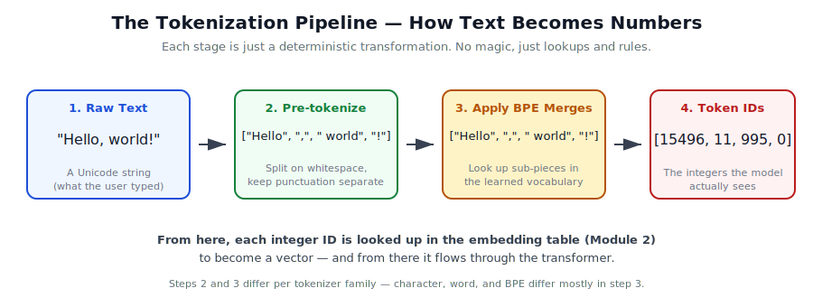
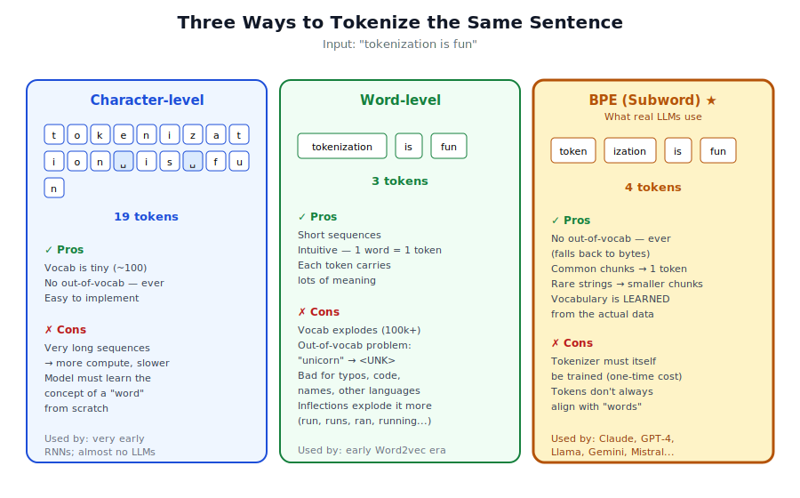
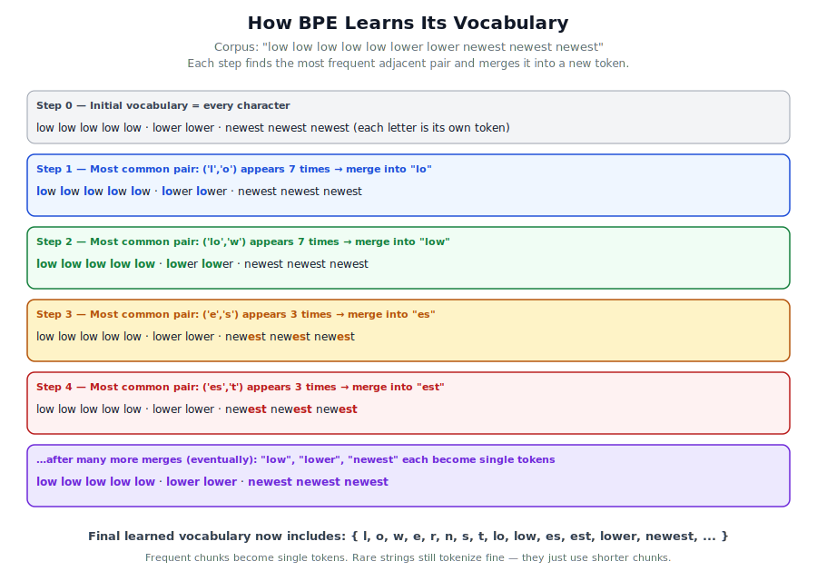

# Module 1 — Tokenization: how text becomes numbers

> **The single most important sentence in this module:**
> A tokenizer is a deterministic function that converts a string of characters into a list of integers, and a deterministic inverse that converts the integers back. Everything else is detail.

This module is longer than Module 0, because tokenization is the bridge between "language" and "math." Get it wrong and the rest of the model can't recover. Get it right and almost nothing else in the stack cares whether the input was English, Mandarin, JSON, or Python code.

---

## 1. The problem we're solving

A neural network can only do arithmetic on numbers — specifically, on vectors of floating-point numbers. But text is not a number. It is a *sequence of characters* (in fact, a sequence of *Unicode code points*, which themselves are a sequence of *bytes*). So we need an unambiguous, reversible recipe:

```
"Hello, world!"      ←  human-facing
        ↓ encode
[15496, 11, 995, 0]  ←  what the model actually sees
        ↑ decode
"Hello, world!"      ←  back to human-facing
```

A **tokenizer** is that recipe. The set of all possible output integers is the **vocabulary**. Each integer is a **token ID**, and the string it stands for is its **token**.



The diagram above shows the four stages. Stages 1, 2, and 4 are the same for every modern tokenizer. **Stage 3 — applying the merges — is where the design choices live**, and it's what makes character vs. word vs. BPE tokenizers differ.

---

## 2. What text actually *is* to a computer

This is worth a minute. When you type `"héllo"`, your computer doesn't store letters — it stores a sequence of bytes following a standard called **UTF-8 Unicode**.

```
"h"   →  0x68          (1 byte)
"é"   →  0xC3 0xA9     (2 bytes — accented characters use more)
"l"   →  0x6C
"l"   →  0x6C
"o"   →  0x6F
```

So `"héllo"` is actually `[0x68, 0xC3, 0xA9, 0x6C, 0x6C, 0x6F]` — six bytes, not five characters.

**Why this matters:** the worst-case fallback for any tokenizer is "treat input as a sequence of bytes." Every byte value (0–255) lives in the vocabulary as a single token, so the tokenizer *can never fail*. Even if a user types something the tokenizer has never seen — a rare emoji, a typo, code in a language nobody trained on — the tokenizer can always fall back to one-token-per-byte. Modern BPE tokenizers (like Claude's, GPT's, Llama's) include all 256 byte values in their vocabulary for exactly this reason. This variant is called **byte-level BPE**.

---

## 3. The three families of tokenizers



### 3.1 Character-level

Each character is one token.

```
"hello"  →  ['h', 'e', 'l', 'l', 'o']  →  [7, 4, 11, 11, 14]
```

| | |
|---|---|
| **Vocab size** | ~100 (for English) — tiny |
| **Sequence length** | Very long (1 token per character) |
| **OOV problem** | None — every char is in vocab |
| **Used by** | Very early RNN-era models. Almost no modern LLM. |

Why not use this? Computation in a transformer is roughly `O(n²)` in the sequence length `n` because every token attends to every other token. A 1,000-character paragraph would be 1,000 tokens — 10× more compute than a word-level tokenizer might use, for the same content. Also, the model has to learn what a *word* even is from scratch, which wastes capacity.

### 3.2 Word-level

Each whole word is one token.

```
"hello world"  →  ['hello', 'world']  →  [42, 87]
```

| | |
|---|---|
| **Vocab size** | 100k+ — large and unboundedly growing |
| **Sequence length** | Short |
| **OOV problem** | **Severe.** Unknown words → `<UNK>` |
| **Used by** | Early Word2vec-era models. Not modern LLMs. |

The fatal flaw is the OOV (out-of-vocabulary) problem. Real users type names, typos, slang, URLs, emoji, other languages, code, and brand new words ("rizz", "skibidi", "gpt"). A word-level tokenizer can't know any of those, and an LLM whose input is half `<UNK>` cannot work.

### 3.3 Subword — Byte-Pair Encoding (BPE) ★

The winner. Used (in slightly different flavors) by Claude, GPT-3/4/5, Llama, Gemini, Mistral, Qwen — virtually every production LLM.

The key idea: **vocabulary is *learned* from data, and tokens are chunks of characters of varying length.** Frequent chunks (like `" the"`, `"ing"`, `"tion"`, `" function"`) become single tokens. Rare chunks fall back to smaller pieces, all the way down to individual bytes.

```
"tokenization"  →  ['token', 'ization']                  → [1234, 5678]
"asdfqwerty"    →  ['as', 'df', 'q', 'wer', 'ty']         → [...]      (still works!)
```

| | |
|---|---|
| **Vocab size** | 32k–200k (chosen as a hyperparameter) |
| **Sequence length** | Short — common words are 1 token |
| **OOV problem** | None — always falls back to bytes |
| **Used by** | Every modern LLM in some variant |

---

## 4. How BPE actually trains its vocabulary

This is the algorithm in plain English. Then we visualize it. Then `03_bpe_tokenizer.py` runs it.

**Inputs:** a big text corpus, and a target vocabulary size `V`.

1. **Initialize.** The vocabulary starts as every individual character (or byte) that appears in the corpus.
2. **Count pairs.** Look at every adjacent pair of tokens across the corpus. Count how often each pair occurs.
3. **Merge the winner.** Take the most common pair, glue it into a single new token, and add it to the vocabulary. Replace every occurrence in the corpus.
4. **Repeat** steps 2–3 until the vocabulary reaches size `V`.

The output is two things: the vocabulary, and the **ordered list of merges** that were learned. To tokenize new text later, you apply the merges in the same order.



A worked example on the corpus *"low low low low low lower lower newest newest newest"*:

| Step | Most common pair (count) | New token | What the corpus looks like after |
|---|---|---|---|
| 0 | (every char is its own token) | — | `l o w   l o w   ...   n e w e s t` |
| 1 | `('l', 'o')` × 7 | `lo` | `lo w   lo w   ...   n e w e s t` |
| 2 | `('lo', 'w')` × 7 | `low` | `low   low   ...   n e w e s t` |
| 3 | `('e', 's')` × 3 | `es` | `... new es t` |
| 4 | `('es', 't')` × 3 | `est` | `... new est` |
| 5 | `('new', 'est')` × 3 | `newest` | `... newest` |

After enough merges, the most useful "chunks" become single tokens. A new word like `lowest` would still tokenize fine — it becomes `["low", "est"]` using merges 2 and 4.

---

## 5. The design trade-off, in one picture

Every tokenizer choice is a position on a triangle:

```
              Sequence length (cost)
                        │
                  Char  •
                       /
                      /
                     /
                BPE  ★    ← real LLMs sit here
                   /
                  /
            Word •
                  ──────────
                  Vocab size · OOV risk
```

- Smaller vocab → simpler model, but longer sequences = more compute.
- Bigger vocab → shorter sequences, but more memory and risk of OOV.
- BPE lets you *tune* the vocab size and learns where the sweet spot is from the data.

For reference, real LLMs:
- GPT-2: vocab ≈ 50,257
- GPT-4 / Claude (cl100k variant): vocab ≈ 100,000
- Llama-3: vocab ≈ 128,000
- Gemini: ~250,000

---

## 6. Special tokens — beyond just text

Every real tokenizer reserves a handful of integer IDs for **special tokens** that don't represent any text but carry structural meaning:

| Token | Purpose |
|---|---|
| `<BOS>` | Beginning-of-sequence — marks the start of input |
| `<EOS>` | End-of-sequence — model emits this when "done" |
| `<PAD>` | Padding — fills shorter sequences in a batch to equal length |
| `<UNK>` | Unknown (rarely used in BPE, included for safety) |
| `<\|user\|>`, `<\|assistant\|>` | Role markers in a chat — Claude/GPT separate turns |
| `<\|system\|>` | System prompt boundary |

When you chat with Claude, your message and the model's reply are wrapped in these role tokens *before* tokenization. The model isn't learning to "understand chat" from scratch — it's learning to predict the right tokens to emit after `<\|assistant\|>`.

---

## 7. Real-world gotchas (the famous "tokens aren't words" stuff)

A few things that catch everyone the first time:

**(a) The leading space matters.** In most modern tokenizers, `"hello"` and `" hello"` are *different tokens*. The space is part of the next token, not the previous one. This is why if you write `"The dog"` versus `"The  dog"` (extra space), the second tokenizes into more tokens.

**(b) Numbers tokenize weirdly.** `"12345"` might become `["123", "45"]` or `["1234", "5"]` depending on which sub-strings the tokenizer learned. This is why early LLMs were bad at arithmetic — the digits weren't reaching the model as digits. Modern tokenizers often force each digit to be its own token to fix this.

**(c) Different languages compress differently.** English typically compresses to ~0.75 tokens/word. Chinese/Japanese is closer to 1 token/character (worse compression). This is why non-English text costs more in API tokens.

**(d) Tokenization is the most common bug source in fine-tuning.** If your training tokenizer doesn't match your inference tokenizer *exactly* (including special tokens, byte fallbacks, normalization), the model's outputs become gibberish.

---

## 8. Why this matters for everything that follows

A few cascading consequences:

| Thing | Why tokenization controls it |
|---|---|
| **Context window** | Claude's "200k context" means 200k *tokens*, not characters. A code file with lots of unusual identifiers tokenizes to *more* tokens than an English paragraph of the same length. |
| **API cost** | You're charged per token, not per word or character. |
| **Math ability** | Bad number tokenization → bad arithmetic. |
| **Speed** | Generation time is roughly linear in tokens produced. Shorter token sequences = faster responses. |
| **Cross-language quality** | A model trained mostly on English will tokenize other languages inefficiently and have less "thinking room" per sentence. |

---

## 9. What's in this module

- `01_char_tokenizer.py` — the simplest case, in ~30 lines
- `02_word_tokenizer.py` — see the OOV problem in action
- `03_bpe_tokenizer.py` — a real BPE tokenizer trained from scratch on a small text; watch the merges happen
- `images/` — the three SVG diagrams referenced above

Run them in order. By the end of this module, **every piece of text in our project is a list of integers** — and the next module (Embeddings & Attention) turns those integers into something the model can actually *reason* about.

---

## 10. Optional rabbit holes

If you want to go deeper at some point:

- **SentencePiece** (Google) — a popular alternative to plain BPE that doesn't need pre-tokenization (handles whitespace as just another character). Used by Llama and many multilingual models.
- **WordPiece** (Google, used in BERT) — almost identical to BPE but uses likelihood instead of raw counts to pick merges.
- **Unigram LM** — yet another subword scheme that starts with a big vocab and prunes.
- **Tiktoken** — OpenAI's open-source BPE tokenizer library. Try `pip install tiktoken` and `tiktoken.encoding_for_model("gpt-4").encode("Hello world")` to see GPT-4's actual tokenizer at work.

Onward to **Module 2 — Embeddings & Attention**, where these integer IDs become *meaning*.
