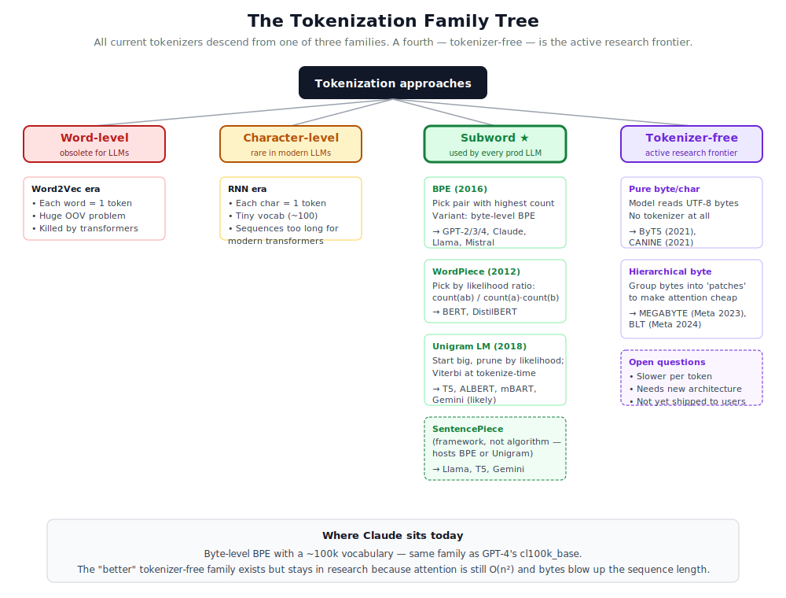

# Module 1 — Tokenization: how text becomes numbers

> **The single most important sentence in this module:**
> A tokenizer is a deterministic function that converts a string of characters into a list of integers, and a deterministic inverse that converts the integers back. Everything else is detail.

This module is the bridge between "language" and "math." Get it wrong and the rest of the model can't recover. Get it right and almost nothing else in the stack cares whether the input was English, Mandarin, JSON, or Python code.

---

## 1. The problem we're solving

A neural network can only do arithmetic on numbers — specifically, on vectors of floating-point numbers. But text is not a number. It is a *sequence of characters* (in fact, a sequence of *Unicode code points*, which themselves are a sequence of *bytes*). So we need an unambiguous, reversible recipe:

```
"Hello, world!"      ←  human-facing
        ↓ encode
[15496, 11, 995, 0]  ←  what the model actually sees
        ↑ decode
"Hello, world!"      ←  back to human-facing
```

A **tokenizer** is that recipe. The set of all possible output integers is the **vocabulary**. Each integer is a **token ID**, and the string it stands for is its **token**.


The diagram above shows the four stages. Stages 1, 2, and 4 are the same for every modern tokenizer. **Stage 3 — applying the merges — is where the design choices live**, and it's what makes character vs. word vs. BPE vs. WordPiece vs. Unigram differ.

---

## 2. What text actually *is* to a computer

This is worth a minute. When you type `"héllo"`, your computer doesn't store letters — it stores a sequence of bytes following a standard called **UTF-8 Unicode**.

```
"h"   →  0x68          (1 byte)
"é"   →  0xC3 0xA9     (2 bytes — accented characters use more)
"l"   →  0x6C
"l"   →  0x6C
"o"   →  0x6F
```

So `"héllo"` is actually `[0x68, 0xC3, 0xA9, 0x6C, 0x6C, 0x6F]` — six bytes, not five characters.

**Why this matters:** the worst-case fallback for any tokenizer is "treat input as a sequence of bytes." Every byte value (0–255) lives in the vocabulary as a single token, so the tokenizer *can never fail*. Even if a user types something the tokenizer has never seen — a rare emoji, a typo, code in a language nobody trained on — the tokenizer can always fall back to one-token-per-byte. Modern BPE tokenizers (Claude's, GPT's, Llama's) include all 256 byte values for exactly this reason. This variant is called **byte-level BPE**.

---

## 3. The three families of tokenizers


A quick overview before we deep-dive into each method:

### 3.1 Character-level

Each character is one token.

```
"hello"  →  ['h', 'e', 'l', 'l', 'o']  →  [7, 4, 11, 11, 14]
```

| | |
|---|---|
| **Vocab size** | ~100 (English) — tiny |
| **Sequence length** | Very long |
| **OOV problem** | None |
| **Used by** | Very early RNN-era models. Almost no modern LLM. |

Why not use this? Computation in a transformer is roughly `O(n²)` in the sequence length. A 1,000-character paragraph is 1,000 tokens — 10× more compute than a word-level tokenizer would use for the same content. The model also has to learn what a *word* is from scratch.

### 3.2 Word-level

Each whole word is one token.

```
"hello world"  →  ['hello', 'world']  →  [42, 87]
```

| | |
|---|---|
| **Vocab size** | 100k+ and unboundedly growing |
| **Sequence length** | Short |
| **OOV problem** | **Severe.** Unknown words → `<UNK>` |
| **Used by** | Word2vec-era models. Not modern LLMs. |

The fatal flaw is OOV (out-of-vocabulary). Users type names, typos, slang, URLs, emoji, other languages, code, brand-new words. A word-level tokenizer can't know any of those, and an LLM whose input is half `<UNK>` cannot work.

### 3.3 Subword

The winner. Used (in different flavors) by every modern LLM. The vocabulary is *learned* from data, and tokens are chunks of characters of varying length. Frequent chunks become single tokens; rare chunks fall back to smaller pieces, all the way down to individual bytes.

We'll cover the four production-relevant variants in Section 5.

---

## 4. The complete family tree (and where Claude fits)



There are four families at the highest level: word-level (obsolete), character-level (very rare), **subword (every production LLM)**, and tokenizer-free (research frontier). The subword family itself splits into four meaningful variants. Let's walk through each one.

---

## 5. Deep dive — every subword method, with implementations

This section is long because the differences are subtle and matter in practice. After this section you'll understand exactly what each algorithm does, where it's used, and what its trade-offs are.

### 5.1 Plain BPE (Byte-Pair Encoding)

**File:** `03_bpe_tokenizer.py`
**Original paper:** Sennrich, Haddow, Birch — *Neural Machine Translation of Rare Words with Subword Units* (2016)
**Used by:** Original GPT, RoBERTa (with byte-level variant below)

The algorithm in plain English:

1. **Initialize.** Vocabulary = every individual character that appears in the corpus.
2. **Count pairs.** For every adjacent pair of tokens across the corpus, count occurrences.
3. **Merge the winner.** Take the most common pair, glue it into a single new token, add it to the vocabulary.
4. **Repeat** until vocabulary reaches the target size (typically 32k–100k).

The output is two things: the vocabulary, and the **ordered list of merges**. To tokenize new text later, you apply the merges in the same order.


A worked example on *"low low low low low lower lower newest newest newest"*:

| Step | Most common pair (count) | New token | Corpus after |
|---|---|---|---|
| 0 | (every char is its own token) | — | `l o w   l o w   ...   n e w e s t` |
| 1 | `('l', 'o')` × 7 | `lo` | `lo w   lo w   ...   n e w e s t` |
| 2 | `('lo', 'w')` × 7 | `low` | `low   low   ...   n e w e s t` |
| 3 | `('e', 's')` × 3 | `es` | `... new es t` |
| 4 | `('es', 't')` × 3 | `est` | `... new est` |
| 5 | `('new', 'est')` × 3 | `newest` | `... newest` |

Pros: simple, fast, well-understood. Cons: greedy left-to-right application can produce sub-optimal segmentations; can't gracefully handle unseen characters.

### 5.2 Byte-level BPE — what GPT-4 and Claude actually use

**File:** `04_byte_level_bpe.py`
**Used by:** GPT-2, GPT-3, GPT-4, **Claude**, RoBERTa, modern Llama

The fix for plain BPE's "unseen character" problem: start from **UTF-8 bytes** instead of characters. Every input string on Earth is a valid sequence of bytes in `{0..255}`, so single-byte tokens are always a fallback.

The algorithm is *identical* to plain BPE — same merging rule, same training loop — just operating on bytes instead of characters. The implementation is a 5-line change.

```python
# Plain BPE start:
symbols = tuple(list(word))               # split into characters

# Byte-level BPE start:
symbols = tuple((b,) for b in word.encode("utf-8"))   # split into bytes
```

A merge might now combine bytes that span character boundaries — that's fine. After enough merges, common UTF-8 sequences (like the two bytes for `é`, or the three bytes for `你`) become single tokens.

Why this dominates production:
- Vocabulary always has 256 single-byte tokens as fallback → **cannot fail on any input**
- Robust to multilingual text, emoji, code, raw binary, anything
- Same compression efficiency as plain BPE for common languages
- One unified tokenizer for *all* inputs

This is what OpenAI's `tiktoken` library ships and what Claude uses internally.

### 5.3 WordPiece

**File:** `05_wordpiece.py`
**Original paper:** Schuster & Nakajima — *Japanese and Korean Voice Search* (2012)
**Used by:** BERT, DistilBERT, ELECTRA, MobileBERT

The algorithm is identical to BPE *except* the rule for picking which pair to merge:

| Algorithm | Merge selection rule |
|---|---|
| BPE | pair with highest **count** |
| WordPiece | pair with highest **score**: `count(ab) / (count(a) · count(b))` |

That score is a *likelihood ratio* — "how much more common is `(a,b)` together than if `a` and `b` were independent?"

This prevents merging things like `(' ', 'e')` just because both pieces are very common individually. WordPiece favors pairs that *genuinely* belong together as a unit.

In practice the vocabularies BPE and WordPiece produce are very similar in quality. The choice comes down to ecosystem (BERT family → WordPiece, GPT/Llama family → BPE).

### 5.4 Unigram Language Model

**File:** `06_unigram.py`
**Original paper:** Kudo — *Subword Regularization* (2018)
**Used by:** T5, ALBERT, mBART, XLM-R, and most multilingual models

Unigram is the *philosophical opposite* of BPE and WordPiece:

| Family | Approach |
|---|---|
| BPE / WordPiece | **Build up** the vocabulary by greedy merging |
| Unigram | **Start big** (every plausible substring), **prune down** by likelihood |

Each token in the vocabulary has an estimated probability `p(token)`. To tokenize a new word, Unigram considers *every possible segmentation* and picks the one that maximizes the product of token probabilities:

```
"unhappy"  could be:
   ["u", "n", "h", "a", "p", "p", "y"]              prob = p(u)·p(n)·... = small
   ["un", "happy"]                                   prob = p(un)·p(happy) = bigger
   ["un", "hap", "py"]                               prob = p(un)·p(hap)·p(py)
   ...
```

The best segmentation is found by **Viterbi** dynamic programming — `O(n²)` in the word length, with the cleanly intuitive recurrence:

```
best_score[i] = max over j of:  best_score[j] + log p(word[j:i])
```

Why it matters:
- More principled than BPE's greedy merging
- Naturally supports **stochastic tokenization** ("subword regularization") — sampling among near-optimal segmentations during training, which acts as a strong data augmentation
- Excellent for multilingual models where the "right" subword units differ across scripts

### 5.5 SentencePiece — the framework (not an algorithm)

**Used by:** Llama (1/2/3), T5, mBART, Gemini (likely), Mistral

A common confusion: **SentencePiece is a library, not a tokenizer algorithm**. It implements both BPE and Unigram, and adds one important contribution: it treats whitespace as just another character (specifically `▁`, the underscore), so it doesn't need a separate pre-tokenization step. This makes it consistent across languages (especially those without spaces, like Chinese and Japanese).

```
"Hello world"   →  with SentencePiece  →  ["▁Hello", "▁world"]
```

When you read "Llama uses SentencePiece BPE" — that means "Llama uses BPE, implemented via the SentencePiece library, with the `▁` whitespace handling."

### 5.6 Summary comparison

| Method | Selection rule | Tokenization | Vocab size | Used by |
|---|---|---|---|---|
| Character | (none) | trivial | ~100 | Early RNNs |
| Word | (none) | whitespace + punctuation | 100k+ | Word2vec era |
| BPE | max count | greedy merges | 30k–100k | Original GPT |
| **Byte-level BPE** | max count (on bytes) | greedy merges | ~100k | **Claude, GPT-2/3/4** |
| WordPiece | max likelihood ratio | greedy merges | 30k | BERT family |
| Unigram | EM likelihood | Viterbi | 32k | T5, multilingual |
| SentencePiece | (framework) | BPE or Unigram | varies | Llama, Gemini |

Run `07_compare_tokenizers.py` to see all of these on the same sample text, plus GPT-4's real tokenizer (if `tiktoken` is installed).

---

## 6. What does Claude actually use in production?

What's publicly known and what's reasonable inference:

**Confirmed / strongly indicated**
- Claude uses a **byte-level BPE** tokenizer in the same family as OpenAI's `cl100k_base` and `o200k_base`.
- The vocabulary size is in the **~100k–200k** range — comparable to GPT-4's ~100k and similar to or larger than the o200k variant.
- The tokenizer handles **arbitrary input** (any bytes, any language, any code, any emoji) because of the byte-level fallback.

**Reasonable inference (not officially confirmed in detail)**
- Special tokens for chat structure: `<|user|>`, `<|assistant|>`, `<|system|>`, plus `<|begin_of_text|>`-style markers similar to other modern chat LLMs.
- Tokenizer updates between major model versions (Claude 1 → 2 → 3 → 4 → 4.5 likely each refined the vocab for better multilingual + code support).
- Tokens for common code patterns and structured formats — production Claude is heavily code-aware.

**What this means practically**
- Anything you type to Claude tokenizes. You will never see an error like "input contains invalid characters."
- Chinese, Japanese, Korean text tokenizes to *more* tokens than English text of the same character count (the price of byte-level: multi-byte UTF-8 characters).
- Code tokenizes efficiently — common patterns like `def `, `function`, `import`, ` // `, ` /* ` are usually single tokens.

---

## 7. The research frontier — could-be-better tokenizers

Tokenization isn't a solved problem. Several lines of research try to do *better* than the byte-level BPE family. Some are early and some are starting to look serious.

### 7.1 ByT5 (Google, 2021)

What it does: train a T5-style transformer that reads **raw UTF-8 bytes**. No tokenizer at all — the model gets one byte at a time and learns its own internal "tokens."

Why it might be better:
- No multilingual bias — every language is treated identically
- Robust to typos, weird spelling, code, anything
- Eliminates tokenizer drift bugs

Why it isn't dominant: 4–5× longer sequences than BPE, so compute is ~16–25× worse for the same content (because attention is `O(n²)`). The released ByT5 models are slow and never reached frontier scale.

### 7.2 CANINE (Google, 2021)

A character-level BERT that **downsamples** within the model — early layers compress every 4 characters into a single representation, so most layers don't pay the full character-level cost. Clever, but didn't catch on outside research.

### 7.3 MEGABYTE (Meta, 2023)

A more architectural solution: organize bytes into fixed-size **patches** (e.g. groups of 8 bytes). Run a small fast transformer *inside* each patch and a larger model *across* patches. This makes attention quadratic only within each patch, not across the whole sequence.

This made byte-level competitive on perplexity for the first time, and trained models up to 1.5B params on bytes only. But fixed-size patches don't align with natural word boundaries, so the patches sometimes contain "half a word."

### 7.4 BLT (Byte Latent Transformer, Meta, late 2024)

The likely successor to MEGABYTE. The key improvement: **dynamic patching** — instead of fixed-size patches, BLT chooses patch boundaries based on byte-level entropy. High-entropy regions (unpredictable bytes) get split more finely; low-entropy regions (predictable continuations like `tion`) get bigger patches. This matches what a smart BPE-style chunking would do, but learned automatically and end-to-end.

BLT matches Llama-3-class performance on standard benchmarks with no tokenizer. This is the most promising tokenizer-free result so far.

### 7.5 Honorable mentions
- **SuperBPE** (2024) — a refinement of BPE that allows tokens to span multiple words, gaining further compression for repeated phrases.
- **Tokenformer** (2024) — treating tokens themselves as model parameters; lets you grow vocabulary without retraining.

---

## 8. Why haven't the better methods replaced BPE?

This is the question the user asked, and the honest answer has five parts.

**(a) Sequence length is the bottleneck.** Attention is `O(n²)`. Byte sequences are ~4–5× longer than BPE sequences. Even a 2× longer sequence quadruples attention cost, and the increase is far worse in production where memory is the binding constraint, not just FLOPs.

**(b) The ecosystem is built around tokens.** Pretrained model weights, fine-tuning libraries, model-serving infrastructure, vector databases, RAG pipelines, monitoring dashboards, billing systems — all of these are denominated in tokens. Switching to bytes means rebuilding all of it.

**(c) Tokenizer-free architectures aren't drop-in.** MEGABYTE and BLT require their *own* architectural changes (patch encoders, hierarchical attention). You can't just train Llama-3 on bytes; you need a fundamentally different model.

**(d) BPE is "good enough" for most production needs.** The known problems with BPE — bad arithmetic, multilingual unfairness, occasional tokenizer drift — are real but workable. Math gets patched (force-split digits). Multilingual unfairness is acknowledged as a research problem but doesn't block deployment. Few enterprise customers ask "is your tokenizer byte-level Latin-biased?"

**(e) Frontier labs have other priorities.** When you're racing to scale parameter counts, multimodality, agentic use, post-training, and safety, tokenization is far from the limiting factor. The expected gain from "go tokenizer-free" is real but small (~10–20% on multilingual perplexity at best), and the cost is a from-scratch retrain at frontier scale (tens of millions of dollars).

**Best guess for the future:** the next generation of models won't all suddenly drop tokenizers. But the BLT-style hierarchical-byte approach is the most likely successor. Watch for "Llama-5" or "Claude X" to quietly mention "tokenizer-free input" the way GPT-2 quietly mentioned "byte-level BPE" in 2019 — five years later, everyone uses it.

---

## 9. The design trade-off, in one picture

Every tokenizer choice is a position on a triangle:

```
              Sequence length (cost)
                        │
                  Char  •
                       /
                      /
                     /
                BPE  ★    ← real LLMs sit here
                   /
                  /
            Word •
                  ──────────
                  Vocab size · OOV risk
```

For reference, real LLM vocabulary sizes:
- GPT-2: 50,257
- GPT-4 (`cl100k_base`): 100,277
- GPT-4o (`o200k_base`): 200,019
- Llama-3: 128,256
- Gemini: ~256,000
- Claude: comparable to GPT-4 family

---

## 10. Special tokens — beyond just text

Every real tokenizer reserves a handful of integer IDs for **special tokens** that don't represent text but carry structural meaning:

| Token | Purpose |
|---|---|
| `<BOS>` | Beginning-of-sequence — marks the start of input |
| `<EOS>` | End-of-sequence — model emits this when "done" |
| `<PAD>` | Padding — fills shorter sequences in a batch to equal length |
| `<UNK>` | Unknown (rarely used in byte-level BPE) |
| `<\|user\|>`, `<\|assistant\|>` | Role markers in a chat |
| `<\|system\|>` | System prompt boundary |
| `<\|tool_use\|>`, `<\|tool_result\|>` | Tool-call markers (modern agentic models) |

When you chat with Claude, your message and the model's reply are wrapped in these role tokens *before* tokenization. The model isn't learning to "understand chat" from scratch — it's learning to predict the right tokens to emit after `<|assistant|>`.

---

## 11. Real-world gotchas

**(a) The leading space matters.** In most modern tokenizers, `"hello"` and `" hello"` are *different tokens*. The space is part of the next token, not the previous one.

**(b) Numbers tokenize weirdly.** `"12345"` might become `["123", "45"]` or `["1234", "5"]` depending on which sub-strings the tokenizer learned. This is why early LLMs were bad at arithmetic. Modern tokenizers often **force each digit to be its own token** to fix this.

**(c) Different languages compress differently.** English typically compresses to ~0.75 tokens/word. Chinese/Japanese is closer to 1 token/character (worse compression). This is the main reason non-English text costs more in API tokens.

**(d) Tokenization is the most common bug source in fine-tuning.** If your training tokenizer doesn't match your inference tokenizer *exactly* (including special tokens, byte fallbacks, normalization), outputs become gibberish.

**(e) Prompt injection via tokens.** Adversarial input can include rare token combinations that confuse the model. Production systems sometimes pre-filter raw input or canonicalize whitespace to prevent this.

---

## 12. Why this matters for everything that follows

| Thing | Why tokenization controls it |
|---|---|
| **Context window** | Claude's "200k context" means 200k *tokens*, not characters. Code with unusual identifiers tokenizes to *more* tokens than English of the same length. |
| **API cost** | You're charged per token, not per word or character. |
| **Math ability** | Bad number tokenization → bad arithmetic. |
| **Speed** | Generation time is roughly linear in tokens produced. |
| **Cross-language quality** | A model trained mostly on English will tokenize other languages inefficiently. |

---

## 13. What's in this module

Core:
- `01_char_tokenizer.py` — character-level (the trivial case)
- `02_word_tokenizer.py` — see the OOV problem in action
- `03_bpe_tokenizer.py` — classic BPE from scratch on a small corpus

Production-grade methods:
- `04_byte_level_bpe.py` — **what Claude and GPT actually use**; handles emoji, Chinese, raw bytes
- `05_wordpiece.py` — BERT's variant; same algorithm but with likelihood-ratio scoring
- `06_unigram.py` — T5's variant; "start big and prune" + Viterbi tokenization

Bonus / comparison:
- `07_compare_tokenizers.py` — run them all side-by-side on the same paragraph
- `08_byte_only_no_tokenizer.py` — what tokenizer-free models like ByT5/MEGABYTE see

Diagrams:
- `images/01_pipeline.svg` — the four-stage pipeline
- `images/02_comparison.svg` — char vs word vs BPE side-by-side
- `images/03_bpe_process.svg` — the BPE merge algorithm visualized
- `images/04_family_tree.svg` — the complete family tree of all methods

Run them in numerical order. By the end every piece of text in our project is a list of integers — and Module 2 turns those integers into *meaning*.

---

## 14. Optional rabbit holes

- **Tiktoken (OpenAI's library)** — `pip install tiktoken; tiktoken.get_encoding("cl100k_base").encode("Hello world")`. The actual GPT-4 tokenizer, fast and well-documented.
- **The original BPE paper** — Sennrich et al. 2016. Very readable.
- **Andrej Karpathy's minBPE** — github.com/karpathy/minbpe. The educational reference implementation; worth reading after this module.
- **SentencePiece** — github.com/google/sentencepiece. The library most non-OpenAI labs use.
- **MEGABYTE paper** — Meta, 2023. The first tokenizer-free model competitive at scale.
- **BLT paper** — Meta, 2024. The current state of the art for tokenizer-free architectures.

Onward to **Module 2 — Embeddings & Attention**, where these integer IDs become *meaning*.
