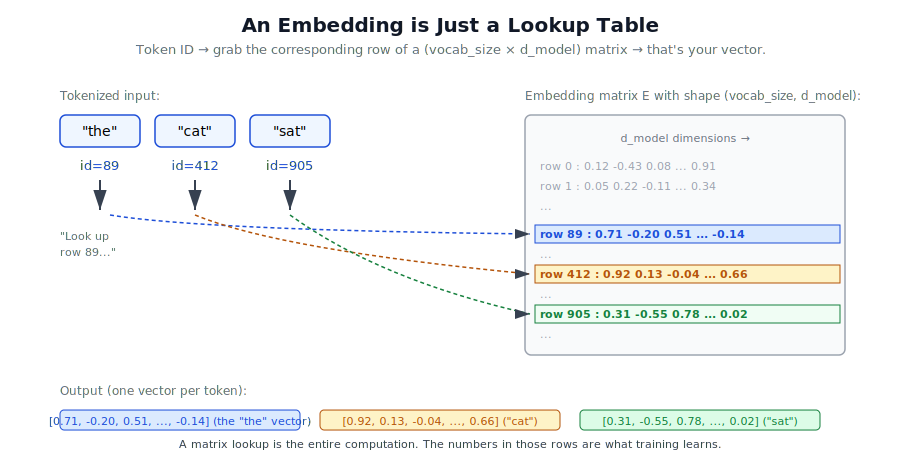
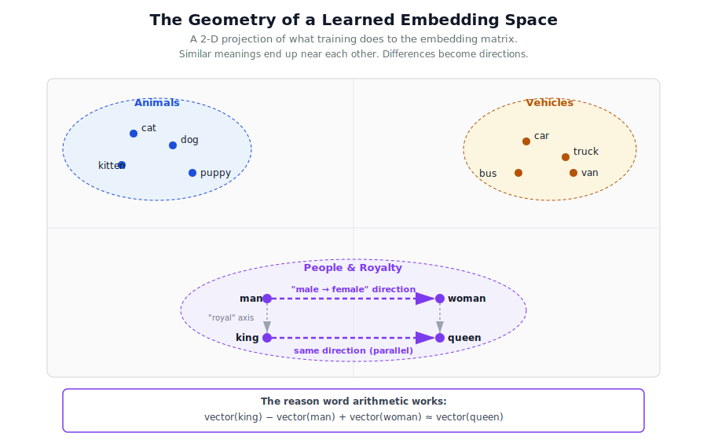

# Module 2 — Embeddings & Attention

This module is the conceptual heart of every modern LLM. If you understand what's on this page, you understand 80% of the architecture of Claude, GPT, Llama, and Gemini.

We're going to answer two questions:

1. How does a token-ID (just an integer like `1234`) become a **meaning**?
2. How does the model figure out which words in a sentence relate to which?

---

# Part 1 — Embeddings: from ground up to production

This section is long because embeddings are deceptively deep. The mechanics fit on one slide — it's a matrix lookup. The *consequences* ripple through cost, capacity, retrieval, multimodality, and how production LLMs are deployed.

## 1.1 The problem: turning an integer into meaning

Module 1 ended with a sentence as a list of integers:

```
"the cat sat"  →  [89, 412, 905]
```

But the integer `412` for "cat" has no meaning. `412` is not "bigger" than `411` in any useful sense; the IDs are arbitrary labels handed out by the tokenizer. The model can't do arithmetic on labels. We need each token to become a **rich vector of numbers** that captures its meaning, so that "cat" and "kitten" end up *geometrically* close, and "cat" and "spreadsheet" end up far apart.

## 1.2 Why not one-hot? (a useful detour)

The obvious first idea: pick a vocabulary size `V`, and represent token `i` as a length-`V` vector that's all zeros except for a single `1` in position `i`.

```
vocab_size = 5
"cat" = id 2 → [0, 0, 1, 0, 0]
```

This is called a **one-hot encoding**. It works in the sense that the model can tell tokens apart. But it's catastrophic in three ways:

1. **No notion of similarity.** Every one-hot vector is orthogonal to every other one-hot vector — their dot product is zero. The model can't tell that "cat" and "kitten" are more related than "cat" and "tractor"; they all look equidistant.
2. **Wildly wasteful.** With a 100k-token vocabulary, every input becomes a 100,000-dim vector that's 99,999 zeros. Multiplying that by a 100k × 4096 matrix is mostly wasted work.
3. **Doesn't scale.** Adding a new token means growing every layer that consumes the one-hot vector.

We want something **dense** (small, all values used), **learned** (captures meaning from data, not hand-coded), and **structured** (related concepts end up nearby in vector space). That's an embedding.

## 1.3 The dense embedding lookup, in one picture

An embedding is just a giant matrix `E` with shape `(vocab_size, d_model)`. Row `i` is the meaning vector for token `i`. To embed a sentence, you grab the relevant rows.



That's the entire mechanical story. In PyTorch this is one line:

```python
import torch.nn as nn
embedding = nn.Embedding(num_embeddings=vocab_size, embedding_dim=d_model)
vectors = embedding(token_ids)        # shape: (batch, seq_len, d_model)
```

`nn.Embedding` is literally a `(vocab_size, d_model)` matrix plus an indexing operation. No multiplication needed — it's a lookup.

> **Tip:** mathematically, the embedding lookup is *equivalent* to multiplying the one-hot vector by a `(vocab_size, d_model)` weight matrix. Lookup is the cheap implementation.

## 1.4 Where do the numbers in the matrix come from?

This is where the magic actually lives.

At the start of training, **every entry in `E` is a small random number**, drawn from something like `Normal(mean=0, std=0.02)`. The matrix is meaningless. Tokens have no semantic structure. "Cat" might be closer to "calculus" than to "kitten".

Then training happens, and the numbers in `E` get **nudged** thousands of times per batch by gradient descent. After enough training, the geometry of `E` looks like this:



Three big phenomena emerge:

| Phenomenon | What it means |
|---|---|
| **Clusters** | Synonyms and related concepts crowd into the same neighborhood. |
| **Axes of meaning** | Differences become *directions*. The "male → female" direction is roughly the same regardless of which word pair you compute it from. |
| **Word arithmetic** | Because differences are directions, you can *add and subtract*: `vector(king) − vector(man) + vector(woman) ≈ vector(queen)`. |

Nobody designed any of this. It's an emergent side-effect of optimizing the model on a prediction task.

Run `01b_embedding_training.py` to see all of the above happen in ~50 lines of NumPy.

## 1.5 How embeddings actually get learned (the gradient story)

The most important sentence in this section: **the embedding matrix is part of the model's trainable parameters, and its rows get updated by the same gradient descent that updates everything else.**

The gradient flow looks like this:

1. The model makes a prediction (e.g., the next token).
2. The loss measures how wrong it was.
3. Backpropagation computes "if we'd nudged each parameter slightly, would loss have gone up or down?"
4. **For the input embedding, only the rows of tokens that appeared in this batch get a non-zero gradient.** Their gradients say: "shift my row in *this* direction to make next-token prediction better."
5. Apply the update.

Repeat with billions of batches. The end result: token embeddings have organized themselves into whatever geometry minimizes prediction loss.

In real LLMs the supervisory signal isn't "pull these two words together"; it's "predict the next token correctly." But the principle is identical, and the embedding geometry that results captures meaning *because* meaning is what helps predict the next word.

The skip-gram trainer in `01b_embedding_training.py` uses a stand-in objective (pull positive pairs together, push random pairs apart) because it's easier to see what's happening — but the gradient mechanics are the same.

## 1.6 Embedding dimension: the capacity dial

How big is `d_model`? Some real numbers:

| Model | `d_model` |
|---|---|
| GPT-2 small | 768 |
| GPT-2 XL | 1,600 |
| GPT-3 | 12,288 |
| Llama-3-70B | 8,192 |
| Claude (estimated) | similar order |

Bigger `d_model` means each token can carry richer meaning — more axes along which words can differ. But cost grows:

- **Embedding parameter count** = `vocab_size × d_model`. For Llama-3 that's `128,000 × 8,192 ≈ 1.0 billion parameters in the embedding alone.**
- Every downstream layer's weight matrices are also `d_model × d_model` or bigger, so cost is at least quadratic in `d_model`.
- Memory for activations grows linearly in `d_model`.

The rule of thumb: pick `d_model` to match the depth and data scale of the model. More data and more layers can usefully consume a bigger embedding.

## 1.7 Tied weights: input embedding ≡ output projection

A trick used by nearly every modern LLM (GPT-2 onward, Llama, Claude likely included).

At the **input**, we use `E` of shape `(vocab_size, d_model)` to turn IDs into vectors.

At the **output**, the final layer needs to do the opposite: turn a vector back into a probability distribution over the vocabulary. That requires a matrix of shape `(d_model, vocab_size)`.

These two matrices are transposes of each other in shape. **So we make them literally the same matrix** — sharing weights between input embedding and output projection.

Why this matters:
- Halves the parameter count of the (often-largest) layer.
- Training signal flows both ways: every output-side gradient updates the same embeddings that the input lookup reads from. Embeddings learn richer geometry as a result.
- This is called **weight tying** or **shared embeddings**.

## 1.8 Static vs. contextual embeddings — the big shift

This is one of the most important conceptual upgrades from the Word2vec era to the transformer era.

### Static embeddings (Word2vec, GloVe, 2013–2017)

The embedding `E[i]` is **fixed** once trained. Every occurrence of "bank" gets the same vector — whether the sentence is about *river banks* or *financial banks*. Polysemy (one word, multiple meanings) is broken.

```
"I deposited money at the bank."     ← "bank" gets vector v
"We had a picnic on the river bank." ← also v — model can't tell the difference!
```

### Contextual embeddings (BERT, GPT, Claude, 2018+)

The embedding layer still gives each token a starting vector, but then **the transformer's attention mechanism mixes information from surrounding tokens into each position**. After the first transformer layer, the vector at position "bank" is no longer just `E[bank]` — it's been shaped by the words around it.

```
After layer 1: "bank" near "money"  → vector points toward "financial"
After layer 1: "bank" near "river"  → vector points toward "geography"
```

Modern LLM "embeddings" are these *contextual* representations — they capture not just the word but its role in this specific sentence. That's why a single sentence embedding from BERT can outperform the best Word2vec at most downstream tasks.

We'll see exactly how attention produces this contextualization in Part 2 of this file.

## 1.9 Initialization in practice

Some practical numbers used in real LLMs:

- **Scale.** `Normal(0, 0.02)` is the GPT-2 default. Llama uses something similar. The small standard deviation prevents activations from blowing up after passing through dozens of layers.
- **Normalization layers** (covered in Module 3 — LayerNorm or RMSNorm) keep things stable from there.
- **Special tokens** (`<BOS>`, `<EOS>`, etc.) get the same random init as any other token. Their meaning is learned during training.
- **Token frequency matters.** A token that appears in 1% of batches gets ~100× more gradient updates than a token that appears in 0.01%. Rare tokens learn slower — sometimes never fully — which is one reason byte-level fallback matters.

## 1.10 The embedding layer is often the biggest single layer

This is a fact people don't appreciate until they start counting parameters.

For a model with vocab 128k and d_model 4096:

- Embedding layer: `128,000 × 4,096 ≈ 524M params`
- A single transformer block's attention: `4 × 4,096² ≈ 67M params`

The embedding can be 10× any individual transformer block. Some implications:

- **It's a memory hotspot.** Inference frameworks shard or offload it.
- **It's a quantization target.** Embeddings are often quantized aggressively (int8, int4) because they tolerate it well — the rest of the network smooths out any noise.
- **Extending vocabulary is expensive.** Adding 1,000 new tokens to a 128k vocab in a `d_model = 4096` model means initializing 4M new parameters from scratch and training them up to match the rest. This is what happens when you fine-tune to add a new language or domain.

## 1.11 Positional information also lives at the embedding stage

Self-attention (Part 2) is **order-blind** — shuffling the tokens shuffles the outputs identically. So the model has no inherent way to tell "the cat sat" from "sat the cat" unless we *inject position information* into the embeddings.

Three common ways:

| Approach | What it does | Where it's used |
|---|---|---|
| **Learned absolute** | Add a second `(max_seq_len, d_model)` matrix `P`, look up row `t` for position `t`, sum: `E[token] + P[t]`. | Original BERT, GPT-2 |
| **Sinusoidal** | Use deterministic sine/cosine waves at different frequencies as the position vector. No new parameters. | Original 2017 Transformer paper |
| **RoPE (Rotary Position Embedding)** | Instead of *adding* position, *rotate* the query and key vectors by an angle proportional to position before computing attention. | Llama, Mistral, Gemma, modern open models — and very likely Claude |

We'll implement positional encoding in Module 3 (when we assemble a full transformer block). For now, just know: by the time vectors leave the embedding stage and enter the first attention layer, each one already encodes "what token am I, and where in the sequence am I?"

## 1.12 Multimodal embeddings — text, images, and audio in one space

A profound generalization. The whole transformer machinery doesn't care that its inputs are "words". It just operates on vectors. So **if you can turn an image, an audio clip, or a video frame into a vector of size `d_model`, the same transformer can read it.**

This is how modern multimodal models like Claude with vision, GPT-4o, and Gemini work:

- **Text** → tokenize → embedding lookup → vectors
- **Image** → break into patches → each patch goes through a small CNN → vectors of size `d_model`
- **Audio** → spectrograms → convolutional encoder → vectors of size `d_model`

These vectors all get concatenated into one sequence and fed to the same transformer. The model's "vocabulary" effectively grows to include "any-modality patch", and embeddings stop being a literal table lookup and become a more general projection.

The famous **CLIP** model (2021) trained a text encoder and image encoder *jointly* so a photo of a cat and the sentence "a photo of a cat" land on the same vector. That's the principle that powers image search, image generation guidance (Stable Diffusion, DALL-E), and image understanding in modern chatbots.

## 1.13 Sentence and document embeddings — and how RAG works

Everything above describes **token-level** embeddings. But sometimes you want a single vector that represents a whole document, e.g. to do search.

How to get one:
- **Mean pooling** — average the token vectors.
- **CLS token** — prepend a special `[CLS]` token to the input; use its output vector. (BERT-style.)
- **Last token** — use the final token's vector. (Common with decoder-only LLMs.)

Once you have one vector per document, you put millions of them in a **vector database** (Pinecone, Weaviate, FAISS, pgvector). At query time:

1. Embed the user's question into a vector.
2. Find the top-k most similar document vectors by cosine similarity.
3. Stuff those documents into the LLM's context window.
4. The LLM answers using them.

That's **RAG — Retrieval-Augmented Generation**, the most common production pattern for LLM apps. Embeddings are the indexing layer that makes it possible.

## 1.14 Production tricks worth knowing

- **Weight tying** (Section 1.7) is so universal it's basically default.
- **Quantization** of the embedding matrix to int8 or int4 saves significant memory at almost no quality cost.
- **Gradient accumulation per row** — frameworks like PyTorch use a sparse gradient for the embedding lookup, so a batch of 4,096 tokens only touches a few thousand rows out of 128,000. This makes embedding updates fast even at scale.
- **Vocabulary extension** during fine-tuning is supported by `model.resize_token_embeddings(new_size)` in HuggingFace. The new rows are initialized from a small Normal distribution.
- **Embedding caching** at inference — for long-running services with high traffic, the embeddings for common system prompts are cached and never re-computed.

---

That's embeddings end-to-end. The crucial intuition to carry forward: **embeddings are a learned geometry. Meaning lives in directions and distances in that geometry.** Attention, which we'll cover next, is what lets the model *reshape* that geometry in a context-dependent way.

---

# Part 2 — The big idea: attention

Now the real puzzle. Once every token is a vector, how does the model know that in:

> "The animal didn't cross the street because **it** was too tired."

the word "it" refers to "animal", not "street"?

The model needs a way for every token to **look around** and decide which other tokens are relevant to its own meaning. That mechanism is **attention**, and it's the single most important innovation in modern AI.

## The library analogy

Imagine you walk into a library with a specific question — that's your **Query**.

Every book on the shelf has a label describing what it's about — that's the **Key** of each book.

You scan the labels, picking up on which books match your question. The actual *content* of each book — that's the **Value**.

You don't just read one book; you read a *weighted mix* of all the books, with more weight on the ones whose labels matched your question best.

That's attention in one paragraph.

## The mechanism, in three steps

Suppose we have a sentence of `n` tokens, each embedded as a vector of size `d`. Stack them into a matrix `X` of shape `(n, d)`.

**Step 1. Project the same input into three different "views"** — using three learned weight matrices `W_Q`, `W_K`, `W_V`:

```
Q = X · W_Q      (n × d)   "what each token is asking about"
K = X · W_K      (n × d)   "what each token has to offer as info"
V = X · W_V      (n × d)   "the actual content each token will share"
```

Same input, three different projections. The matrices are learned during training.

**Step 2. Score: which tokens should attend to which?**

We compute the dot product between every query and every key — a similarity score for every pair of tokens:

```
scores = Q · K^T            (n × n)
```

Cell `(i, j)` is "how much should token i attend to token j?"

We scale by `√d` (this keeps the numbers stable as `d` grows — without it, softmax saturates):

```
scores = (Q · K^T) / √d
```

Then **softmax** turns the scores into a probability distribution across each row — each row sums to 1:

```
attention_weights = softmax(scores)    (n × n)
```

**Step 3. Mix the values using those weights:**

```
output = attention_weights · V         (n × d)
```

Each output row is a *weighted blend* of all the value vectors, with the blend determined by who attends to whom.

That's it. The whole formula:

```
Attention(Q, K, V) = softmax( Q·K^T / √d ) · V
```

This single line is what made the transformer revolution possible.

## Causal masking (decoder-only models like Claude)

When the model is **generating** text, token at position `i` cannot be allowed to see future tokens at positions `i+1, i+2, ...` — that would be cheating.

So before the softmax, we add `-∞` (in practice a huge negative number) to all the entries above the diagonal of the scores matrix. After softmax, those become 0, meaning "ignore those positions."

This is why Claude and GPT are called **decoder-only** or **causal** transformers — every token can only attend backward.

## Multi-head attention

One set of `(Q, K, V)` matrices learns one "way" to relate tokens. But what if we want the model to track several relationships at once — syntax, coreference, topic, position — in parallel?

Answer: **do attention several times in parallel** with different `W_Q`, `W_K`, `W_V` matrices, then concatenate the outputs.

Each parallel attention is called a **head**. GPT-3 uses 96 heads; Claude uses something in that range too.

In code:

```
Split embedding dim into H heads:  d = H × d_head
Run attention separately on each head
Concatenate the H output vectors back into one
Final projection through one more matrix W_O
```

That's multi-head attention.

---

## What attention is *not*

A common confusion: attention is **not** the only thing that changes per token. After attention, every token also goes through a feedforward network (basically a 2-layer MLP) — but that comes in Module 3 (the transformer block).

Also: raw attention is **order-blind** — if you shuffle the input tokens, the outputs shuffle too. That's why we needed positional information injected at the embedding stage (Section 1.11).

---

## What's in this module

- `01_embeddings.py` — a hand-built embedding layer; the `king − man + woman = queen` arithmetic in code
- `01b_embedding_training.py` — **NEW** — watch random embeddings ORGANIZE themselves into semantic clusters via simplified Word2vec training
- `02_attention_from_scratch.py` — scaled dot-product attention with a causal mask, every intermediate matrix printed
- `03_multi_head_attention.py` — multi-head attention as a clean class
- `images/` — the embedding lookup and embedding space diagrams referenced above

Run them in order. Pay particular attention to the printed `attention_weights` matrix in file 02 — that's the famous "attention map." Once that picture clicks, you really do see how the model "thinks."

Onward.
